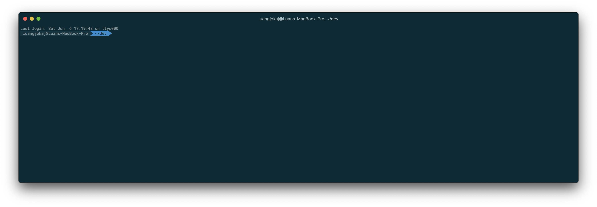

# iTerm

### Fonts: [Powerline-patched font](https://github.com/powerline/fonts)

## [iTerm Profile](./iTermProfile.json)
**Appearance**
- Theme: **Minimal**
- Tab bar location: **Top**
- Status bar location: **Top**
- Font: [`Roboto Mono Medium for Powerline 12pt`](https://github.com/powerline/fonts)
## [Oh My ZSH](https://ohmyz.sh/)
- Theme: [`agnoster`](https://github.com/agnoster/agnoster-zsh-theme)
- Plugins: [`zsh-autosuggestions`](https://github.com/zsh-users/zsh-autosuggestions/)
- Configuration: [`.zshrc`](./.zshrc)

## Secreenshot

